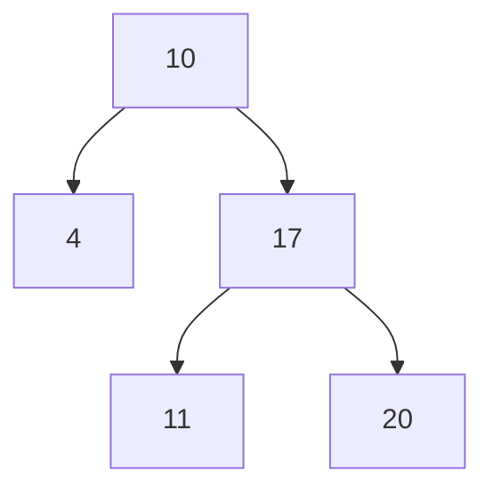

While making a tree, I needed to draw it for a blog post. I looked for ways to draw trees in MDX.

I decided to use Mermaid.

> [Mermaid](https://mermaid.js.org)

- Mermaid is a library that draws diagrams using a syntax like markdown.
- It supports many types of diagrams.
- You can use it by putting it directly in markdown.

## Installation

```bash
npm i mermaid
npm i -D @types/mermaid
```

## Making a Mermaid Component

We make a component that gets chart data and shows Mermaid.

```tsx
"use client";

import React, { useEffect, useRef } from "react";
import mermaid from "mermaid";

type MermaidProps = {
  chart: string;
};

const Mermaid: React.FC<MermaidProps> = ({ chart }) => {
  const chartRef = useRef<HTMLDivElement>(null);

  useEffect(() => {
    if (chartRef.current) {
      mermaid.initialize({ startOnLoad: true });
      mermaid.contentLoaded();
    }
  }, [chart]);

  return (
    <div className="mermaid" ref={chartRef}>
      {chart}
    </div>
  );
};

export default Mermaid;
```

## Adding Mermaid Component to MdxRemote

```tsx
// lib/mdx-components.tsx
export const mdxComponents = {
  // ... existing components,
  Mermaid,
};

// app/ui/article-list.tsx
<MDXRemote source={post.content} components={mdxComponents} />;
```

## Let's try using it



<Mermaid
  chart={`
    graph TD
      A[10] --> B[4]
      A --> C[17]
      C --> D[11]
      C --> E[20]
  `}
/>

The tree is drawn nicely. 🎉
