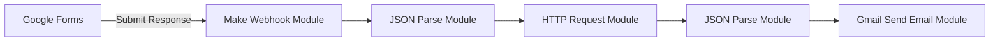

## What is Make (formerly Integromat)?

Make is a no-code integration platform that allows you to visually connect various web services and APIs to build automated workflows (called scenarios) without writing a single line of code.
With its drag-and-drop interface, you can easily design processes like Trigger → Data Processing → Action, and it supports over 1,000 apps and services (e.g., Google Workspace, Slack, Airtable, HTTP APIs, etc.).

---

## Key Features

- Visual Workflow Editor
  Build logic by connecting modules like a flowchart. Easily manage branching, loops, and conditions via the GUI.

- Real-time and Scheduled Execution
  Run instantly via webhooks or schedule tasks to repeat by minute, hour, or day.

- Error Handling
  Set up error branches for each module, with retry and rollback logic for reliability.

- Built-in Datastore
  Store data in simple table form—great for logs, stats, or managing workflow states.

- Flexible HTTP Module
  Make custom REST API calls with full control over headers, query strings, and request bodies.

---

## Quick Use Case: Summarize Google Forms Input with AI and Send via Email

### 1. Scenario Overview

1. Trigger: Google Forms → Webhook
2. AI Processing: OpenAI API (text summarization)
3. Action: Send summary via Gmail

### 2. Module Structure



1. Webhook Module

   - Create a custom webhook → Set Google Forms to send responses to it

2. JSON Parse Module

   - Extract `user_text` and `user_email` from `{{body.responses}}`

3. HTTP Request Module

   - Method: POST

   - URL: `https://api.openai.com/v1/chat/completions`

   - Headers:

     ```text
     Authorization: Bearer {{YOUR_OPENAI_KEY}}
     Content-Type: application/json
     ```

   - Body:

     ```json
     {
       "model": "gpt-3.5-turbo",
       "messages": [
         { "role": "system", "content": "Summarize the following text." },
         { "role": "user", "content": "{{user_text}}" }
       ],
       "max_tokens": 150
     }
     ```

4. Second JSON Parse Module

   - Extract `summary` from AI response: `response.choices[0].message.content`

5. Gmail Module

   - To: `{{user_email}}`
   - Subject: “Here is your summary”
   - Body:

     ```
     Hello!

     Here is the summary of the text you submitted:

     {{summary}}

     Thank you.
     ```

### 3. Testing and Operation

1. Run in Test Mode → Submit a sample response via Google Forms
2. Check logs → Monitor success/failure
3. (Optional) Save input/output to Datastore or send alerts via Slack

---

## Expansion Ideas

- Multilingual Support: Add language instructions in the AI system prompt
- File Summarization: Extract text from uploaded PDFs via Google Drive → Summarize
- Report Automation: Record results in Airtable or Google Sheets → Visualize with Data Studio
- Chatbot Interface: Connect to Telegram or Slack bot modules for real-time interaction
