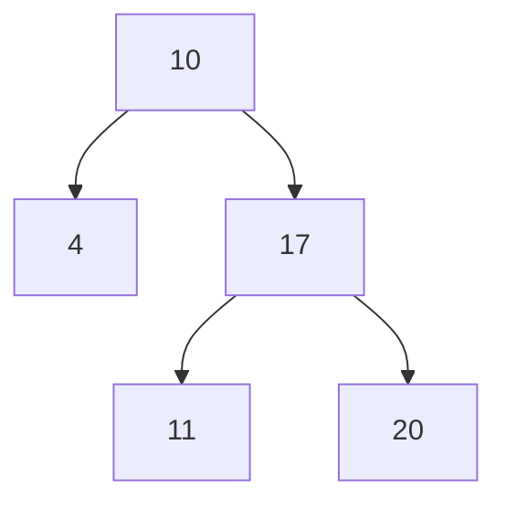

트리를 구현하다보니, 포스팅을 작성하기 위해 그릴 필요가 있었습니다. MDX에 트리를 그리는 방법을 찾아보았습니다.

Mermaid를 사용하기로 했습니다.

> [Mermaid](https://mermaid.js.org)

- Mermaid는 마크다운과 유사한 문법으로 다이어그램을 그리는 라이브러리입니다.
- 다양한 다이어그램을 지원합니다.
- 마크다운에 직접 삽입하여 사용할 수 있습니다.

## 설치

```bash
npm i mermaid
npm i -D @types/mermaid
```

## Mermaid 컴포넌트 생성

chart 데이터를 받아서 Mermaid를 렌더링하는 컴포넌트를 생성합니다.

```tsx
"use client";

import React, { useEffect, useRef } from "react";
import mermaid from "mermaid";

type MermaidProps = {
  chart: string;
};

const Mermaid: React.FC<MermaidProps> = ({ chart }) => {
  const chartRef = useRef<HTMLDivElement>(null);

  useEffect(() => {
    if (chartRef.current) {
      mermaid.initialize({ startOnLoad: true });
      mermaid.contentLoaded();
    }
  }, [chart]);

  return (
    <div className="mermaid" ref={chartRef}>
      {chart}
    </div>
  );
};

export default Mermaid;
```

## MdxRemote에 Mermaid 컴포넌트 추가

```tsx
// lib/mdx-components.tsx
export const mdxComponents = {
  // ... 기존 컴포넌트,
  Mermaid,
};

// app/ui/article-list.tsx
<MDXRemote source={post.content} components={mdxComponents} />;
```

## 사용해보겠습니다



<Mermaid
  chart={`
    graph TD
      A[10] --> B[4]
      A --> C[17]
      C --> D[11]
      C --> E[20]
  `}
/>

트리가 예쁘게 그려졌습니다. 🎉
