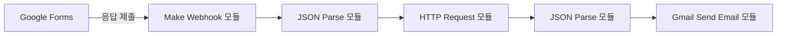

Make(구 Integromat)란?
Make는 코드 작성 없이 다양한 웹서비스와 API를 시각적으로 연결해 자동화된 워크플로우(시나리오)를 구축할 수 있는 노코드(no-code) 통합 플랫폼입니다.  
드래그&드롭 기반의 모듈 연결 인터페이스를 통해 “트리거 → 데이터 처리 → 액션” 과정을 손쉽게 설계할 수 있으며, 1,000개가 넘는 앱·서비스(예: Google Workspace, Slack, Airtable, HTTP API 등)를 지원합니다.

---

## 주요 특징

- 시각적 워크플로우 에디터
  플로우차트처럼 모듈을 연결해 로직을 구성. 분기·반복·조건 처리도 GUI에서 손쉽게.
- 실시간·예약 실행
  웹훅(Webhook) 트리거로 즉시 실행하거나, 스케줄러 모듈로 분·시간·일 단위 반복 실행 가능.
- 에러 핸들링
  각 모듈별 오류 분기 설정, 재시도·롤백 로직을 포함해 안정성 확보.
- 내장 데이터베이스(Datastore)
  간단한 테이블 형태로 기록 저장→로그·통계·상태 관리에 활용.
- 유연한 HTTP 모듈
  RESTful API 호출, 커스텀 헤더·쿼리스트링·바디 구성 가능.

---

## 간단 사용 예제: Google Forms 입력을 AI로 요약해 이메일 발송하기

### 1. 시나리오 개요

1. Trigger: Google Forms → Webhook
2. AI 처리: OpenAI API (텍스트 요약)
3. Action: Gmail로 요약문 전송

### 2. 모듈 구성



1. Webhook 모듈

   - Custom Webhook 생성 → Google Forms ‘응답 후 웹훅 전송’ 설정

2. JSON Parse 모듈

   - `{{body.responses}}` 중 텍스트 필드(`user_text`)와 이메일 필드(`user_email`) 추출

3. HTTP Request 모듈

   - Method: POST
   - URL: `https://api.openai.com/v1/chat/completions`
   - Headers:

     ```text
     Authorization: Bearer {{YOUR_OPENAI_KEY}}
     Content-Type: application/json
     ```

   - Body:

     ```json
     {
       "model": "gpt-3.5-turbo",
       "messages": [
         { "role": "system", "content": "Summarize the following text." },
         { "role": "user", "content": "{{user_text}}" }
       ],
       "max_tokens": 150
     }
     ```

4. 두 번째 JSON Parse 모듈

   - AI 응답(`response.choices[0].message.content`)에서 `summary` 추출

5. Gmail 모듈

   - To: `{{user_email}}`
   - Subject: “요약문 전달드립니다”
   - Body:

     ```
     안녕하세요!

     요청하신 텍스트 요약은 아래와 같습니다.

     {{summary}}

     감사합니다.
     ```

### 3. 테스트 및 운영

1. 테스트 모드로 시나리오 실행 → Google Forms에 예시 응답 입력
2. 로그 확인 → 응답·에러 모니터링
3. (선택) Datastore에 요청·응답 저장하거나 Slack 알림 추가

---

## 확장 아이디어

- 다국어 지원: AI 호출 시 system 메시지에 언어 지시 추가
- 파일 요약: Google Drive PDF 모듈로 업로드 파일 텍스트 추출 → 요약
- 리포트 자동화: Airtable·Google Sheets에 결과 기록 → Data Studio 대시보드 연동
- 챗봇 인터페이스: Telegram, Slack Bot 모듈로 실시간 대화형 서비스 제공
